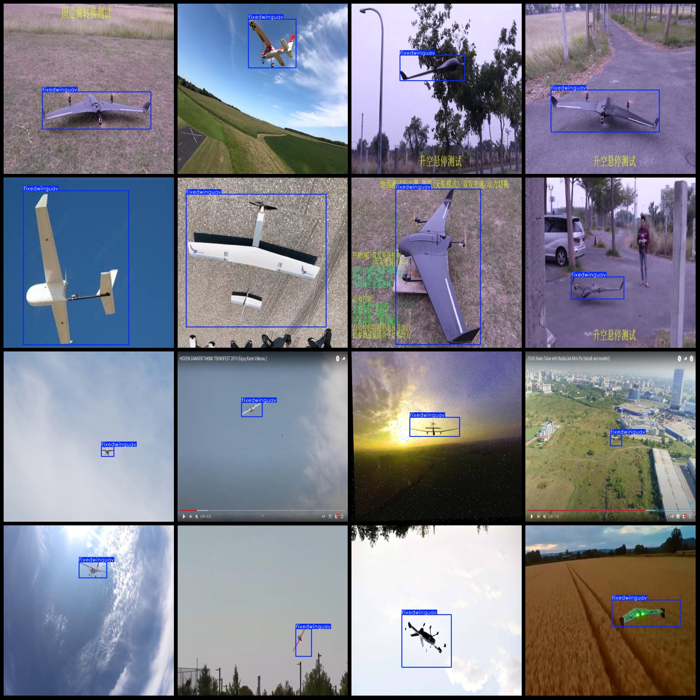
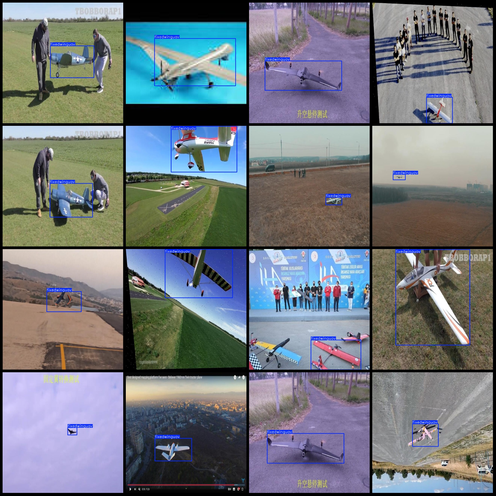

# Fixed-Wing UAV Detection Dataset (VOC+YOLO format, 2388 images in one category)

**Dataset Format:** Pascal VOC format + YOLO format (txt file without split path, just containing jpg images and corresponding VOC format xml files and yolo format txt files)

**Image Count (Number of jpg files):** 2388
**Label Count (Number of xml files):** 2388
**Label Count (txt files):** 2388
**Label Count (Categories):** 1
**Label Name for Categories:** "fixedwinguav"
**Number of Boxes per Category:** 2401
**Total Boxes:** 2401
**Image Resolution:** 640x640
**Annotation Tool:** labelImg
**Annotation Rules:** Draw a box around the category
**Important Notes:** None
**Special Disclaimer:** This dataset does not guarantee the accuracy of the trained models or weight files.
**Preview of Images:**
**Annotation Example:**

## Image

Here is a pay link on Stripe ( https://buy.stripe.com/3cs8yP7sY87d0vu9AB ). Please contact me lonlonago@foxmail.com after funding $89, and I will send you a complete data files , thank you!

